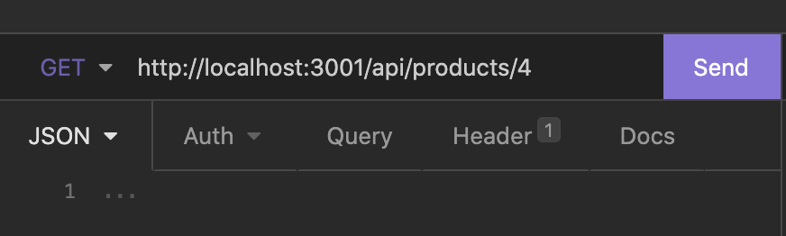
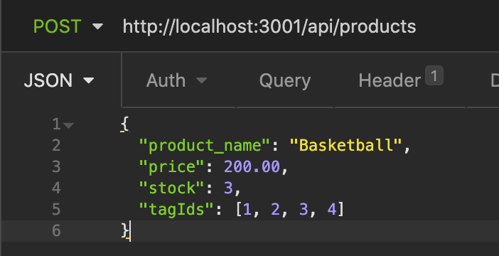
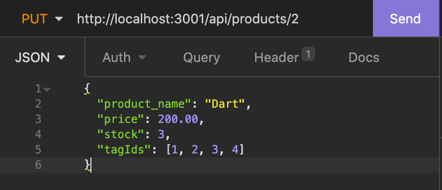

# E-Commerce Back End

## Description

E-Commerce Back End is an application that lets the user performs CRUD operations on parts of a database such as products, categories, and tags of products.

## Installation

To run the application:

- Run the command `npm i` to install the prerequisites
- Navigate to the db folder and type the command `mysql -u root -p` and enter the password to root
- Run the command `node seeds/index.js` to seed the database
- Run the command `ndoe server.js` to start the server

## Usage

  

## Credits

hugh18019  
GitHub Profile: https://github.com/hugh18019

## Links

Walkthrough demo1:  
https://drive.google.com/file/d/1jTgPoYPhx9xV6vEk51TaoTDGZAsPitMr/view?usp=sharing

Walkthrough demo2:  
https://drive.google.com/file/d/1UpbIEyyntJ513o5z9JghtyuDSvgbrxtu/view?usp=sharing

## License

Licensed under the [MIT License](LICENSE).
